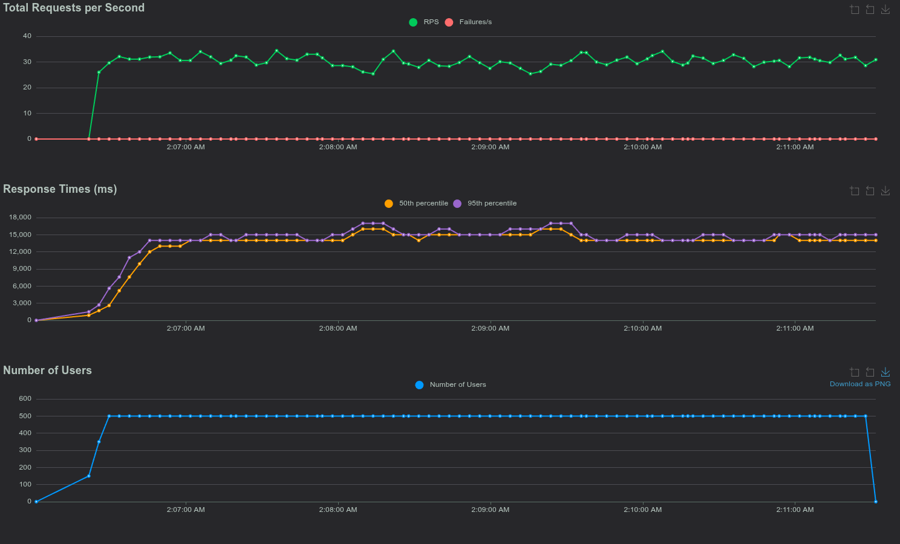

# Technical Test: Generative AI Service (Groq API, FastAPI, Python)

---

## Deskripsi
Project ini adalah solusi technical test untuk membangun AI Service realtime dengan FastAPI & Groq API, serta pengujian load test menggunakan Locust.

---

## Fitur Utama
- Endpoint `/chat` menerima pertanyaan user dan mengembalikan response AI secara streaming (realtime)
- Load test dengan Locust: 50+ pertanyaan random, 500 user, hatch rate 50

---

## Struktur Project & Penjelasan File


```
Groq-Generative-AI/
├── docs/               # Folder untuk chart/gambar hasil load test
│   └── charts.png      # Chart hasil load test Locust
├── src/                # Kode sumber aplikasi
│   ├── __init__.py
│   ├── main.py         # FastAPI app (AI Service)
│   ├── questions.py    # 50+ pertanyaan random untuk load test
├── .env.example        # Contoh environment variable
├── .gitignore          # File/folder yang diabaikan git
├── Locust_2025-09-16-02h06_locustfile.py_http___localhost_8000.html # Report lengkap hasil load test
├── locustfile.py       # Script load test Locust
├── README.md           # Dokumentasi
├── requirements.txt    # Daftar dependensi Python
```

- **src/main.py**: Service utama FastAPI, menerima request user dan meneruskan ke Groq API secara streaming.
- **src/questions.py**: Kumpulan 50+ pertanyaan random (singkat-kompleks) untuk simulasi load test.
- **locustfile.py**: Script untuk load test, mensimulasikan 500 user bertanya ke endpoint `/chat` secara paralel.
- **requirements.txt**: Daftar library yang dibutuhkan (FastAPI, httpx, uvicorn, locust).
- **.env.example**: Contoh environment variable (jangan lupa rename ke .env dan isi API key).
- **.gitignore**: File/folder yang diabaikan git.
- **README.md**: Dokumentasi lengkap project.
- **docs/**: Folder untuk chart/gambar hasil load test.
- **Locust_2025-09-16-02h06_locustfile.py_http___localhost_8000.html**: Report lengkap hasil load test Locust.

---

## Alur Request & Response
1. User (atau Locust) mengirim POST ke `/chat` dengan format JSON:
   ```json
   {
     "messages": [
       {"role": "user", "content": "Apa itu AI?"}
     ]
   }
   ```
2. FastAPI menerima request, meneruskan ke Groq API (model llama-3.1-8b-instant) secara streaming.
3. Response AI dikirim balik ke client secara realtime (streaming, event-stream).

---


## Cara Menjalankan & Pengujian

1. **Install dependensi**
   ```fish
   pip install -r requirements.txt
   ```
2. **Buat file .env**
   - Copy file `.env.example` lalu rename menjadi `.env`:
     ```fish
     cp .env.example .env
     ```
   - Edit `.env` dan isi `GROQ_API_KEY` dengan API key dari https://console.groq.com/

3. **Jalankan FastAPI**
   ```fish
   uvicorn src.main:app --reload
   ```
   Service berjalan di http://localhost:8000

4. **Tes Endpoint Secara Manual**
   Anda bisa mengetes endpoint `/chat` secara manual menggunakan `curl`:
   
   **Dengan curl:**
   ```fish
   curl -X POST http://localhost:8000/chat \
     -H 'Content-Type: application/json' \
     -d '{"messages": [{"role": "user", "content": "Apa itu AI?"}]}'
   ```
   
   Output akan berupa response dari AI secara streaming.


---


## Cara Load Test dengan Locust
1. **Jalankan Locust**
   ```fish
   locust -f locustfile.py --host=http://localhost:8000 --users 500 --spawn-rate 50
   ```
2. **Buka browser ke** http://localhost:8089 untuk memonitor dan memulai test atau tekan enter di terminal.
3. Locust akan mengirim 500 user virtual dengan 50 user per detik, masing-masing mengirim pertanyaan random ke endpoint `/chat`.

---

## Hasil Load Test dengan Locust

**Parameter Pengujian:**
- 500 user, hatch rate 50 user/detik
- 65 pertanyaan random ke endpoint `/chat`
- Durasi: 5 menit


Chart hasil load test Locust dapat dilihat pada gambar berikut:



Data report lengkap tersedia di file HTML:
`Locust_2025-09-16-02h06_locustfile.py_http___localhost_8000.html`

